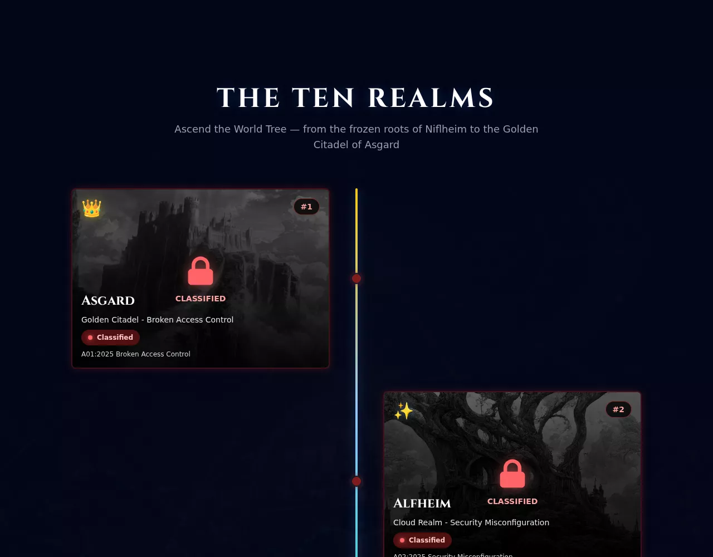

<div align="center">

<p align="center">
  
</p>

# 🌳 Project Yggdrasil

### Ascend the World Tree. Exploit. Learn. Defend.

**A vulnerable-by-design cybersecurity training platform — ten Norse realms, one for each category of the OWASP Top 10:2025.**

[](https://opensource.org/licenses/MIT)
[](https://owasp.org/Top10/)
[](https://www.docker.com/)
[](https://www.typescriptlang.org/)
[](https://nodejs.org/)
[](https://discord.gg/y82Hg9CnSk)

[**Quick Start**](#-quick-start) •
[**The Realms**](#-the-ten-realms) •
[**Architecture**](#-architecture) •
[**Community**](#-join-our-community) •
[**Contributing**](#-contributing)

<sub>Banner and realm artwork inspired by original Yggdrasil concept art by <b>Satanoy</b>.</sub>

</div>

---

## 📖 Overview

**Project Yggdrasil** turns the OWASP Top 10:2025 into an expedition. Instead of a checklist of vulnerabilities, you climb the World Tree — ten Norse mythology-themed realms, each a self-contained web application harboring one class of real-world flaw. Exploit the realm, capture its flag, and the Bifröst opens to the next.

It is built like a product, not a lab dump: a hardened control plane guards ten intentionally vulnerable realms, each sealed in its own isolated Docker network so nothing you break can reach anything you shouldn't. One command brings the whole thing up.

|  |  |
|---|---|
| 🎯 **Learn by breaking** | Hands-on exploitation of real vulnerability classes, mapped 1:1 to OWASP Top 10:2025 |
| 🧗 **Progressive ascent** | Realms unlock in sequence — from the frozen roots of Niflheim to the golden citadel of Asgard |
| 🛡️ **Safe by construction** | Vulnerable code lives only inside network-isolated realm containers; the control plane targets ASVS Level 2 |
| 🏆 **Gamified** | Global leaderboard, per-realm scoring, and optional Discord broadcasts for first-bloods and completions |
| 🧭 **Never truly stuck** | Progressive hints (with a score penalty) that unlock help without ever blocking progression |
| ⚡ **One-command setup** | `make yggdrasil` — environment, dependencies, and the full stack, ready in minutes |

> [!WARNING]
> This project contains **intentionally vulnerable code** for education. It is designed to be exploited. Never deploy it to production or expose it to the public internet. See [Security](#-security).

---

## 🗺️ The Ten Realms

The climb starts underground and rises toward the light. Each realm is a distinct environment demonstrating one OWASP category — and the difficulty grows with the altitude.

| Realm | Order | OWASP Category | The Challenge |
|-------|:-----:|----------------|---------------|
| 👑 **Asgard** | `01` · Final | [A01:2025](https://owasp.org/Top10/2025/A01_2025-Broken_Access_Control/) Broken Access Control | Golden Citadel — IDOR & SQLi in the HR vault |
| ✨ **Alfheim** | `02` | [A02:2025](https://owasp.org/Top10/2025/A02_2025-Security_Misconfiguration/) Security Misconfiguration | Cloud Realm — SSRF → IMDS → S3 |
| 🌍 **Midgard** | `03` | [A03:2025](https://owasp.org/Top10/2025/A03_2025-Software_Supply_Chain_Failures/) Supply Chain Failures | Marketplace — compromised package registry |
| 🔐 **Vanaheim** | `04` | [A04:2025](https://owasp.org/Top10/2025/A04_2025-Cryptographic_Failures/) Cryptographic Failures | Merchant Realm — weak PRNG & broken crypto |
| ⚒️ **Nidavellir** | `05` | [A05:2025](https://owasp.org/Top10/2025/A05_2025-Injection/) Injection | Dwarven Forge — SQL injection |
| 🔥 **Muspelheim** | `06` | [A06:2025](https://owasp.org/Top10/2025/A06_2025-Insecure_Design/) Insecure Design | Fire Realm — DeFi race condition |
| ❄️ **Jotunheim** | `07` | [A07:2025](https://owasp.org/Top10/2025/A07_2025-Authentication_Failures/) Authentication Failures | Ice Giant Stronghold — session fixation |
| ⚙️ **Svartalfheim** | `08` | [A08:2025](https://owasp.org/Top10/2025/A08_2025-Software_or_Data_Integrity_Failures/) Software/Data Integrity | Underground Mine — insecure deserialization |
| ☠️ **Helheim** | `09` | [A09:2025](https://owasp.org/Top10/2025/A09_2025-Security_Logging_and_Alerting_Failures/) Logging & Alerting Failures | Níðhöggr SOC — an intrusion logged perfectly, alerted to nobody |
| 🌫️ **Niflheim** | `10` · Entry | [A10:2025](https://owasp.org/Top10/2025/A10_2025-Mishandling_of_Exceptional_Conditions/) Exceptional Conditions | Cryo-Stasis Facility — unhandled overpressure spills crash diagnostics |

<p align="center">
  
  <br/>
  <em>The landing page renders the OWASP Top 10 as a literal climb — Asgard at the crown, Niflheim at the roots.</em>
</p>

---

## ✨ Features

### 🏗️ Platform

- **🔐 Hardened control plane** — the Gatekeeper handles authentication, sessions, CSRF, security headers, and reverse-proxying, following OWASP ASVS Level 2.
- **🎯 Centralized flag validation** — the Flag Oracle validates submissions and enforces linear progression; only the previous realm's flag unlocks the next.
- **🔒 Network isolation** — every realm runs in its own Docker network reachable only through the Gatekeeper, preventing lateral movement.
- **🏆 Leaderboard & scoring** — a Redis sorted-set "Hall of the Slain" with privacy-masked handles and escalating per-realm points.
- **🧭 Progressive hints** — realm-authored hints that cost score but never block you; surfaced as "Mimir's Counsel" in the UI.
- **📣 Discord broadcasts** *(opt-in)* — real-time announcements of captures, first-bloods, and full completions via webhook.
- **📊 Observability** *(opt-in)* — a full Prometheus / Loki / Grafana stack, decoupled so the default startup stays fast.

### 🤖 AI & Security Research

- **🎓 Attack trace generation** — request/response activity logged in a format ready for LLM fine-tuning.
- **📊 Scanner benchmarking** — measure Nuclei, ZAP, and custom scanners against a known-vulnerable baseline.
- **📋 Vulnerability manifests** — CWE/CVSS documentation for all ten realms, validated in CI.
- **🔬 Research tooling** — example notebooks and scorecard generation for scanner evaluation.

---

## 🚀 Quick Start

### Prerequisites

- **Docker** 20.10+ and **Docker Compose** 2.0+ ([install](https://docs.docker.com/get-docker/))
- **Make** (recommended) and **Git**
- Node.js 20+ is only needed for local development *outside* Docker

### One-command setup

```bash
git clone https://github.com/Kaademos/kademos-yggdrasil.git
cd kademos-yggdrasil

# Generate the environment, install dependencies, and start every service
make yggdrasil
```

That's it — the platform is live at **http://localhost:8080/**. Open it, click **INITIATE ASCENSION**, and begin with Niflheim.

> **Prefer to do it in steps?** Run `make setup` then `make up`.
>
> **Want dashboards?** Start the optional observability stack:
> ```bash
> docker compose -f docker-compose.yml -f docker-compose.observability.yml up -d
> ```

### Verify it's healthy

```bash
make quick-test        # health checks for gatekeeper, flag-oracle, landing page, realms API
curl http://localhost:8080/health   # {"status":"ok","service":"gatekeeper"}
```

New here? The [**Quick Start Guide**](QUICKSTART.md) walks through the first ascent in five minutes.

---

## 🏛️ Architecture

The artwork is not just decoration — the World Tree *is* the architecture. The Bifröst is the entry gateway, the trunk is the Gatekeeper proxy carrying "data-sap" upward, each branch is a network-isolated realm, and the crown is the final challenge.

```
┌─────────────────────────────────────────────────────────────────┐
│                         Internet / Player                        │
└───────────────────────────────┬─────────────────────────────────┘
                                 │
                     ┌───────────▼───────────┐
                     │   Yggdrasil Gatekeeper │   Port 8080
                     │  ────────────────────  │
                     │  • Cinematic landing   │
                     │  • Auth & sessions     │
                     │  • Reverse proxy       │
                     │  • Progression gating  │
                     └──┬─────────────────┬───┘
                        │                 │
          ┌─────────────▼──────┐   ┌──────▼──────────────────┐
          │     Flag Oracle    │   │   Realms (10 isolated)  │
          │     Port 3001      │   │  ─────────────────────  │
          │  • Flag validation │   │  Niflheim → … → Asgard  │
          │  • Progression     │   │  each in its own        │
          │  • Scoring & hints │   │  Docker network,        │
          │  (Redis + backup)  │   │  reachable only via     │
          └────────────────────┘   │  the Gatekeeper         │
                                    └─────────────────────────┘
```

### Components

| Component | Stack | Responsibility |
|-----------|-------|----------------|
| **Gatekeeper** | Node.js · Express · TypeScript · React | Landing page, authentication, sessions, CSRF, security headers, reverse proxy, progression gating |
| **Flag Oracle** | Node.js · Express · TypeScript · Redis | Flag validation, progression state, scoring, hints; Redis-primary with file-based fallback |
| **Realms** (×10) | Node.js · Python · Java | Each implements one intentional vulnerability, isolated in its own network |
| **Observability** *(opt-in)* | Prometheus · Loki · Promtail · Grafana | Metrics, log aggregation, dashboards |

### Network topology

```
yggdrasil_main (bridge)
├── gatekeeper   ← the only service attached to every realm network
├── flag-oracle
└── redis

niflheim_net (isolated) └── niflheim
helheim_net  (isolated) └── helheim
…  (8 more isolated realm networks)
asgard_net   (isolated) ├── asgard
                        └── asgard-db (PostgreSQL)
```

> **Key security property:** only the Gatekeeper can reach realm networks. A player who fully compromises one realm still cannot pivot to another — there is no path between realm networks.

---

## 📁 Project Structure

```
kademos-yggdrasil/
├── gatekeeper/            # Control plane: auth, proxy, progression gating
│   ├── frontend/          #   React + Tailwind landing page (Hero, RealmMap, Leaderboard…)
│   ├── src/               #   config · middleware · routes · services · utils
│   └── tests/             #   Jest unit, integration & regression tests
├── flag-oracle/           # Flag validation, scoring, hints (Redis + file fallback)
├── realms/                # Ten challenge environments + shared infra & template
│   ├── niflheim/  …  asgard/
│   ├── _shared/           #   Shared styles, error middleware & templates
│   └── _template/         #   Scaffold for new realms
├── tests/                 # Cross-service E2E, security & integration suites
├── scripts/               # Setup, smoke tests, secret scanning, journey tests
├── config/                # Observability configs (loki, promtail, prometheus, grafana)
├── docs/                  # Developer, operator, workflow & per-realm documentation
├── docker-compose.yml     # Core stack
├── docker-compose.observability.yml   # Optional monitoring stack
└── Makefile               # Developer commands (make help)
```

---

## 🛠️ Development

Run `make help` for the full list. The essentials:

| Command | Description |
|---------|-------------|
| `make yggdrasil` | Setup **and** start everything (first run) |
| `make up` / `make down` | Start / stop all services |
| `make logs` | Tail logs from all services |
| `make dev-gatekeeper` | Run the Gatekeeper with backend + frontend hot reload |
| `make test` | Unit + integration tests |
| `make test-all` | Full suite: unit + integration + E2E + security |
| `make info` / `make urls` | Service status / all accessible URLs |
| `make clean` | Stop, remove volumes, clean artifacts |

### Adding a new realm

1. Scaffold from the template: `cp -r realms/_template realms/your-realm`
2. Configure `package.json`, `src/config/index.ts`, and add its flag to `.env`
3. Register the service and its isolated network in `docker-compose.yml`
4. Add metadata to `gatekeeper/src/config/realms-metadata.ts` (name, order, OWASP category, theme, emblem)
5. Implement the vulnerability, author its `manifest.json` (hints + CWE/CVSS), and add tests

See [CONTRIBUTING.md](CONTRIBUTING.md) for coding standards and the PR process.

---

## 🧪 Testing

Yggdrasil ships a layered test suite, run identically on your machine and in CI so a green local run means a green pipeline.

| Layer | What it covers | Run it |
|-------|----------------|--------|
| **Unit** | Gatekeeper & Flag Oracle logic, realm metadata invariants, React components (jsdom) | `make test-unit` |
| **Integration** | API contracts, realm access & flag generation, smoke tests | `make test-integration` |
| **E2E** | Full Niflheim → Asgard journey and the landing-page ascent (Playwright) | `make test-e2e` |
| **Security** | Security headers, rate limiting, secret scanning | `make test-security` |

```bash
make test        # unit + integration (fast inner loop)
make test-all    # everything
```

Coverage is enforced at **≥70%** for the control plane (gatekeeper & flag-oracle) via Jest thresholds. CI additionally runs ESLint, Prettier, manifest validation, dependency/secret scanning, and a Snyk gate — see [`.circleci/config.yml`](.circleci/config.yml).

---

## 🌐 Join Our Community

Yggdrasil grows best when its builders and breakers learn together.

<div align="center">

[](https://discord.gg/y82Hg9CnSk)

</div>

Whether you're new to security, a seasoned CTF player, or just curious about gamified learning — **you're welcome here.** Inside you can:

- 🧭 **Ask for help** when a realm has you stuck — please keep flags and full write-ups out of public channels so others can enjoy the challenge
- 💡 **Share hint strategies** and discuss the OWASP concepts behind each realm
- 📣 **Get updates** on new realms, events, and releases
- 🤝 **Meet other builders** contributing to Yggdrasil

> When an operator runs Yggdrasil with Discord broadcasts enabled (`DISCORD_WEBHOOK_URL`), successful captures are announced in real time — so the community sees the wins as they happen.

---

## 🔒 Security

> [!CAUTION]
> **The `realms/` directory is vulnerable on purpose.** SQL injection, SSRF, RCE, insecure deserialization and more are the *content*, not bugs.

**Do not** deploy to production, expose to the public internet without isolation, or run on a machine you care about. **Do** run it on an isolated network or a dedicated training host.

The **control plane** (Gatekeeper & Flag Oracle) is held to a different standard and targets OWASP ASVS Level 2: secure session cookies, CSRF protection on state-changing routes, a full set of security headers, rate limiting on auth and flag submission, input validation, environment-based secrets, and Docker network isolation.

Found a flaw in the **control plane** (not an intentional realm vulnerability)? Please report it privately — see [SECURITY.md](SECURITY.md).

---

## 📚 Documentation

| Document | Description |
|----------|-------------|
| [QUICKSTART.md](QUICKSTART.md) | Five-minute setup and first ascent |
| [CONTRIBUTING.md](CONTRIBUTING.md) | Contribution guidelines and standards |
| [SECURITY.md](SECURITY.md) | Vulnerability disclosure policy and scope |
| [CHANGELOG.md](CHANGELOG.md) | Release history |
| [docs/guides/DEVELOPER.md](docs/guides/DEVELOPER.md) | Developer onboarding |
| [docs/guides/OPERATOR_GUIDE.md](docs/guides/OPERATOR_GUIDE.md) | Production deployment & operations |
| [docs/workflows/QUICK_REFERENCE.md](docs/workflows/QUICK_REFERENCE.md) | Commands, APIs, and configs |
| [docs/workflows/ASVS_COMPLIANCE.md](docs/workflows/ASVS_COMPLIANCE.md) | Security controls matrix |
| [docs/AI-TRAINING.md](docs/AI-TRAINING.md) | Attack-trace generation & AI research |

Each realm also carries its own guide (vulnerability, exploit path, flag location, learning objectives) under [`docs/realms/`](docs/realms/) — for example [`docs/realms/10-niflheim.md`](docs/realms/10-niflheim.md).

---

## 🤝 Contributing

Contributions are welcome — new realms, hardening of the control plane, docs, and tooling all help. Start with [CONTRIBUTING.md](CONTRIBUTING.md), then:

1. **Fork** and branch (`feature/…`, `fix/…`, `docs/…`)
2. **Add tests** for new functionality
3. **Run** `make test-all` and ensure ESLint/Prettier pass
4. **Commit** using [Conventional Commits](https://www.conventionalcommits.org/)
5. **Open** a Pull Request

**Standards:** TypeScript strict mode, ≥70% control-plane coverage, no committed secrets, and — critically — **never "fix" an intentional realm vulnerability**; preserve and test the exploit path.

---

## 🗺️ Roadmap

**Shipped**

- ✅ All ten realms implemented, themed, and tested
- ✅ Global leaderboard & per-realm scoring
- ✅ Progressive hints ("Mimir's Counsel")
- ✅ Opt-in Discord broadcasts
- ✅ Opt-in observability stack (Prometheus / Loki / Grafana)
- ✅ Attack-trace generation & scanner benchmarking
- ✅ WCAG AA, mobile-responsive UI

**Planned**

- [Difficulty modes (Easy / Normal / Hard) per realm](../../issues/16)
- [Team mode for collaborative solving](../../issues/17)
- [Achievements & speed badges](../../issues/18)
- [Per-realm completion analytics](../../issues/19)
- [Instructor teaching guides for every realm](../../issues/20)
- [Internationalization (i18n)](../../issues/21)

---

## 🙏 Acknowledgments

Built on [Docker](https://www.docker.com/), [Node.js](https://nodejs.org/), [TypeScript](https://www.typescriptlang.org/), [Express](https://expressjs.com/), [React](https://react.dev/), [Vite](https://vitejs.dev/), [TailwindCSS](https://tailwindcss.com/), [Prometheus](https://prometheus.io/), [Loki](https://grafana.com/oss/loki/), [Grafana](https://grafana.com/), and [Playwright](https://playwright.dev/).

Inspired by the [OWASP Top 10:2025](https://owasp.org/Top10/), the [OWASP ASVS](https://owasp.org/www-project-application-security-verification-standard/), and [Norse mythology](https://en.wikipedia.org/wiki/Norse_mythology). Artwork inspired by original Yggdrasil concept art by **Satanoy**.

---

## 📄 License

Released under the **MIT License** — see [LICENSE](LICENSE).

**Disclaimer:** This platform contains intentionally vulnerable code for educational purposes. Use responsibly and only in controlled environments.

---

## 📞 Support & Contact

- **Issues:** [GitHub Issues](https://github.com/Kaademos/kademos-yggdrasil/issues)
- **Discussions:** [GitHub Discussions](https://github.com/Kaademos/kademos-yggdrasil/discussions)
- **Community:** [Discord](https://discord.gg/y82Hg9CnSk)
- **Control-plane security reports:** see [SECURITY.md](SECURITY.md)

---

<div align="center">

**🌳 Yggdrasil awaits. Begin your ascent. 🌳**

Made with ❤️ for the cybersecurity community

</div>
