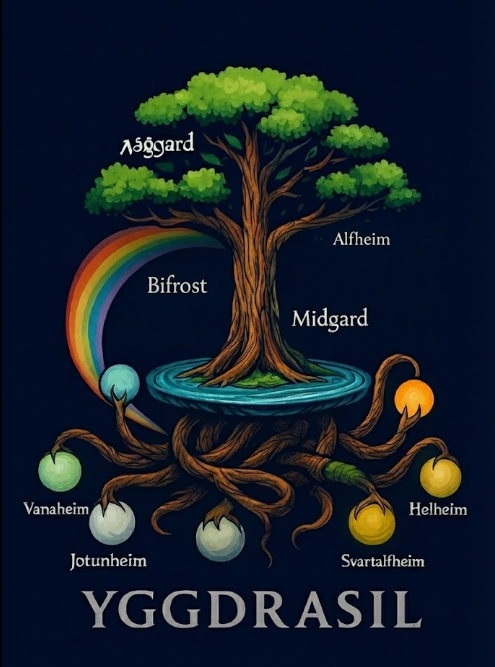

<div align="center">

<p align="center">
  
</p>

> Logo inspired by original Yggdrasil artwork by **Satanoy**.

# Project Yggdrasil

**A Vulnerable-by-Design Cybersecurity Training Platform**

[](https://opensource.org/licenses/MIT)
[](https://www.docker.com/)
[](https://owasp.org/Top10/2025/)
[](https://www.typescriptlang.org/)
[](https://nodejs.org/)

[Features](#-features) •
[Quick Start](#-quick-start) •
[Architecture](#-architecture) •
[Documentation](#-documentation) •
[Contributing](#-contributing)

</div>

---

## 📖 Overview

**Project Yggdrasil** is an immersive, CTF-style cybersecurity training platform featuring ten Norse mythology-themed realms, each demonstrating specific vulnerabilities from the **OWASP Top 10:2025**. Users progress linearly through realms by exploiting intentional security flaws and capturing flags.

### 🎯 Purpose

- **Security Training**: Hands-on experience with real-world vulnerabilities
- **OWASP Alignment**: Direct mapping to OWASP Top 10:2025 categories
- **Progressive Learning**: Linear progression from basic to advanced exploits
- **Safe Environment**: Isolated, containerized challenges with no external risk

### 🌟 The Journey

```
Niflheim (R10) → Helheim (R9) → Svartalfheim (R8) → Jotunheim (R7) → Muspelheim (R6)
     ↓
Nidavellir (R5) → Vanaheim (R4) → Midgard (R3) → Alfheim (R2) → Asgard (R1)
```

Each realm unlocks only after the previous realm's flag is successfully submitted.

---

## ✨ Features

### 🎭 The Realms

| Realm | Order | OWASP Category | Vulnerability Type |
|-------|-------|----------------|-------------------|
| **Niflheim** | 10 (Entry) | A10:2025 | Exceptional Conditions |
| **Helheim** | 9 | A09:2025 | Logging & Alerting Failures |
| **Svartalfheim** | 8 | A08:2025 | Software/Data Integrity |
| **Jotunheim** | 7 | A07:2025 | Authentication Failures |
| **Muspelheim** | 6 | A06:2025 | Insecure Design |
| **Nidavellir** | 5 | A05:2025 | Injection Vulnerabilities |
| **Vanaheim** | 4 | A04:2025 | Cryptographic Failures |
| **Midgard** | 3 | A03:2025 | Supply Chain Failures |
| **Alfheim** | 2 | A02:2025 | Security Misconfiguration |
| **Asgard** | 1 (Final) | A01:2025 | Broken Access Control |

### 🏗️ Platform Features

- **🌐 Landing Page**: "Bifröst Gate" introduction
- **🔐 Secure Control Plane**: ASVS-compliant gatekeeper with session management
- **🎯 Flag Validation**: Centralized flag oracle with progression tracking
- **🔒 Network Isolation**: Each realm in isolated Docker networks
- **📊 Observability**: Full stack monitoring (Prometheus, Loki, Grafana)
- **🧪 Comprehensive Testing**: Unit, integration, E2E, and security tests
- **📖 Documentation**: Complete developer and operator guides

### 🤖 AI & Research Features (New!)

- **🎓 Attack Trace Generation**: Automatic logging in OpenAI fine-tuning format
- **📊 Scanner Benchmarking**: Test Nuclei, ZAP, and custom scanners
- **📋 Vulnerability Manifests**: Comprehensive CWE/CVSS documentation for all 10 realms
- **🔬 Research Tools**: Example notebooks and scripts for AI training
- **📈 Detection Metrics**: Automated scorecard generation for scanner evaluation
- **🌐 Community Datasets**: Share and access attack traces for research

---

## 📦 Editions & Roadmap

Project Yggdrasil is Open Source software. We are currently building an Enterprise tier for organizations running large-scale training events.

| Feature | Community Edition (This Repo) | Enterprise / Pro (Coming Soon) |
| :--- | :---: | :---: |
| **10 Vulnerable Realms** | ✅ | ✅ |
| **Docker Compose Deployment** | ✅ | ✅ |
| **Single-Player Progression** | ✅ | ✅ |
| **Prometheus/Grafana Observability** | ✅ | ✅ |
| **Team Mode & CTF Scoring** | ❌ | ✅ |
| **SSO / SAML Integration** | ❌ | ✅ |
| **Kubernetes / Helm Charts** | ❌ | ✅ |
| **Instructor Analytics Dashboard** | ❌ | ✅ |

> **Interested in Enterprise features?** Star the repo to follow updates or contact us for early access.

---

## 🚀 Quick Start

### Prerequisites

Ensure you have the following installed:

- **Docker** 20.10+ ([Install Docker](https://docs.docker.com/get-docker/))
- **Docker Compose** 2.0+ (usually included with Docker)
- **Make** (optional but recommended)
- **Git**

### One-Command Setup

```bash
# Clone the repository
git clone https://github.com/your-org/project_yggdrasil.git
cd project_yggdrasil

# Single command to setup AND start everything
make yggdrasil
```

That's it! The platform will be running at **http://localhost:8080/**

> **Alternative:** You can also run `make setup` then `make up` separately if you prefer.

### Verification

After startup, you should see:

**Community Edition (default):**
```
════════════════════════════════════════════════════════════════
✅ Project Yggdrasil is running!
════════════════════════════════════════════════════════════════

🌐 Landing Page:  http://localhost:8080/
🏥 Health Check:  http://localhost:8080/health

💡 Quick Start:
   1. Visit http://localhost:8080/ to see the landing page
   2. Click 'INITIATE ASCENSION' to begin
════════════════════════════════════════════════════════════════
```

**Enterprise Edition** (set `YGGDRASIL_EDITION=enterprise` in `.env`):
```
════════════════════════════════════════════════════════════════
✅ Project Yggdrasil is running!
════════════════════════════════════════════════════════════════

🌐 Landing Page:  http://localhost:8080/
🔐 Login:         http://localhost:8080/login
🏥 Health Check:  http://localhost:8080/health

📊 Observability:
   Grafana:       http://localhost:3200 (admin/admin)
   Prometheus:    http://localhost:9090
   Loki:          http://localhost:3100

💡 Quick Start:
   1. Visit http://localhost:8080/ to see the landing page
   2. Click 'INITIATE ASCENSION' to begin
   3. Register/Login and start with Niflheim (Realm 10)
════════════════════════════════════════════════════════════════
```

Visit the landing page and click **"INITIATE ASCENSION"** to begin your journey!

### Configuration

| Variable | Description | Default |
|----------|-------------|---------|
| `YGGDRASIL_EDITION` | Selects edition: `community` (standard) or `enterprise` (full features) | `community` |

**Community Edition** (default): Streamlined experience for guest users with landing page and basic quickstart.

**Enterprise Edition**: Full features including login page, observability dashboards (Grafana, Prometheus, Loki), and extended quickstart steps. Set in `.env`:
```bash
YGGDRASIL_EDITION=enterprise
```

### Manual Setup (Without Make)

```bash
# 1. Create .env file
cp .env.example .env

# 2. Generate secrets (Linux/Mac)
openssl rand -hex 32  # Use for SESSION_SECRET, JOTUNHEIM_SESSION_SECRET
openssl rand -hex 16  # Use for database passwords

# 3. Edit .env and replace <generate-strong-secret-for-production> placeholders

# 4. Install dependencies
cd gatekeeper && npm install && cd ..
cd flag-oracle && npm install && cd ..

# 5. Start services
docker-compose up --build -d

# 6. Check status
docker-compose ps
curl http://localhost:8080/health
```

---

## 🏛️ Architecture

### High-Level Overview

```
┌─────────────────────────────────────────────────────────────────┐
│                         Internet / User                          │
└───────────────────────────────┬─────────────────────────────────┘
                                │
                     ┌──────────▼──────────┐
                     │  Yggdrasil          │
                     │  Gatekeeper         │
                     │  (Port 8080)        │
                     │                     │
                     │  - Landing Page     │
                     │  - Authentication   │
                     │  - Reverse Proxy    │
                     │  - Progression Gate │
                     └──┬──────────────┬───┘
                        │              │
        ┌───────────────┴──┐       ┌──▼─────────────┐
        │  Flag Oracle      │       │  Realms        │
        │  (Port 3001)      │       │  (10 isolated) │
        │                   │       │                │
        │  - Flag Validation│       │  - Niflheim    │
        │  - Progression    │       │  - Helheim     │
        │  - State Tracking │       │  - ...         │
        └───────────────────┘       │  - Asgard      │
                                    └────────────────┘
```

### Components

#### 1. **Gatekeeper** (`yggdrasil-gatekeeper`)
- **Tech Stack**: Node.js, Express, TypeScript, React (landing page)
- **Responsibilities**:
  - Serves cinematic landing page at `/`
  - Handles authentication and session management
  - Reverse proxy to realm services
  - Enforces progression rules (realm locking)
  - Security headers and CSRF protection

#### 2. **Flag Oracle** (`flag-oracle`)
- **Tech Stack**: Node.js, Express, TypeScript
- **Responsibilities**:
  - Validates flag submissions
  - Tracks user progression state
  - Persists data (Redis + JSON file backup)
  - Rate limiting on validation attempts

#### 3. **Realms** (10 challenge environments)
- **Tech Stack**: Varies (Node.js, Python, Java)
- **Each Realm**:
  - Runs in isolated Docker network
  - Implements specific vulnerability
  - Exposes flag upon successful exploit
  - Accessible only via gatekeeper

#### 4. **Observability Stack** (Milestone 6)
- **Loki**: Log aggregation
- **Promtail**: Log collection from containers
- **Prometheus**: Metrics storage and alerting
- **Grafana**: Visualization dashboards

### Network Topology

```
yggdrasil_main (bridge network)
├── gatekeeper (connected to ALL networks)
├── flag-oracle
├── redis
├── loki, promtail, prometheus, grafana

niflheim_net (isolated)
└── niflheim

helheim_net (isolated)
└── helheim

... (8 more isolated realm networks)

asgard_net (isolated)
├── asgard
└── asgard-db (PostgreSQL)
```

**Key Security Feature**: Only the gatekeeper can access realm networks, preventing lateral movement.

---

## 📁 Project Structure

```
project_yggdrasil/
├── docs/                        # Documentation
│   ├── instructor/               # Instructor teaching materials
│   │   ├── README.md             # Instructor notes overview
│   │   └── TEMPLATE.md           # Template for realm guides
│   ├── guides/                   # Developer documentation
|   |   ├── DEVELOPER.md          # Developer getting started guide
│   |   └── OPERATOR_GUIDE.md     # Production operations guide
│   ├── workflows/                # Operational workflows & references
│   |   └── ASVS_COMPLIANCE.md    # Security controls matrix
│
├── gatekeeper/                   # Main control plane service
│   ├── frontend/                 # React landing page (M7)
│   │   ├── src/
│   │   │   ├── components/       # Hero, WeaversPath, RealmMap
│   │   │   ├── hooks/            # useRealms
│   │   │   ├── types/            # TypeScript types
│   │   │   └── styles/           # TailwindCSS
│   │   ├── vite.config.ts
│   │   └── tailwind.config.js
│   ├── src/
│   │   ├── config/               # Configuration & realm metadata
│   │   ├── middleware/           # Auth, CSRF, security headers
│   │   ├── routes/               # API routes
│   │   ├── services/             # Business logic
│   │   └── utils/                # Logging, metrics
│   ├── tests/                    # Unit tests
│   ├── Dockerfile
│   └── package.json
│
├── flag-oracle/                  # Flag validation service
│   ├── src/
│   │   ├── config/
│   │   ├── repositories/         # Data persistence
│   │   ├── routes/
│   │   └── services/
│   ├── tests/
│   ├── Dockerfile
│   └── package.json
│
├── realms/                       # Challenge environments
│   ├── _shared/                  # Shared infrastructure (M13)
│   │   ├── styles/               # Shared CSS (44KB component library)
│   │   ├── middleware/           # Error handling middleware
│   │   ├── templates/            # Error page templates
│   │   └── ERROR-HANDLING-README.md
│   ├── _template/                # Realm template for new challenges
│   ├── niflheim/                 # Realm 10 (Entry) - SCADA, SSRF
│   ├── helheim/                  # Realm 9 - LFI, memorial forum
│   ├── svartalfheim/             # Realm 8 - Java, deserialization
│   ├── jotunheim/                # Realm 7 - Session fixation
│   ├── muspelheim/               # Realm 6 - Race condition, DeFi
│   ├── nidavellir/               # Realm 5 - SQLi, dwarven forge
│   ├── vanaheim/                 # Realm 4 - Weak PRNG, merchant
│   ├── midgard/                  # Realm 3 - Supply chain, registry
│   ├── alfheim/                  # Realm 2 - SSRF→IMDS→S3, cloud
│   ├── asgard/                   # Realm 1 (Final) - IDOR + SQLi, HR
│   └── sample-realm/             # Test realm (M0)
│
├── config/                       # Observability configurations
│   ├── loki/
│   ├── promtail/
│   ├── prometheus/
│   └── grafana/
│
├── scripts/                      # Utility scripts
│   ├── smoke-test.sh             # Integration smoke tests
│   ├── test-*.sh                 # Per-milestone test scripts
│   ├── scan-secrets.sh           # Security scanning
│   └── test-e2e-journey.sh       # Full journey test
│
├── tests/                        # E2E and security tests
│   ├── e2e/
│   │   └── journey/              # Full progression tests
│   ├── security/                 # Security validation
│   └── fixtures/                 # Test data
│
├── docker-compose.yml            # Master orchestration
├── Makefile                      # Development commands
├── .env.example                  # Environment template
├── README.md                     # This file
└── package.json                  # Root package metadata
```

---

## 🛠️ Development

### Available Commands

Run `make help` to see all commands. Key commands:

| Command | Description |
|---------|-------------|
| `make yggdrasil` | One command to setup AND start everything |
| `make setup` | First-time setup (creates .env, installs deps) |
| `make up` | Build and start all services |
| `make down` | Stop all services |
| `make restart` | Restart all services |
| `make logs` | Tail logs from all services |
| `make test` | Run unit + integration tests |
| `make test-all` | Run complete test suite (unit + integration + E2E + security) |
| `make info` | Show service status and configuration |
| `make urls` | Show all accessible URLs |
| `make quick-test` | Run quick health checks |
| `make clean` | Stop services, remove volumes, clean artifacts |

### Running Individual Services in Dev Mode

```bash
# Gatekeeper (with backend + frontend hot reload)
make dev-gatekeeper

# Flag Oracle
make dev-flag-oracle

# Sample Realm
cd realms/sample-realm && npm run dev
```

### Testing

```bash
# Unit tests
make test-unit

# Integration tests
make test-integration

# E2E journey tests (requires services running)
make test-e2e

# Security validation
make test-security

# All tests
make test-all
```

### Adding a New Realm

1. Copy the template:
   ```bash
   cp -r realms/_template realms/your-realm-name
   ```

2. Update configurations:
   - `realms/your-realm-name/package.json`
   - `realms/your-realm-name/src/config/index.ts`
   - Add flag to `.env`

3. Add to `docker-compose.yml`:
   ```yaml
   your-realm-name:
     build:
       context: ./realms/your-realm-name
     environment:
       - FLAG=${YOUR_REALM_FLAG}
     networks:
       - your_realm_net
   ```

4. Add to `gatekeeper/src/config/realms-metadata.ts`

5. Implement vulnerability and tests

---

## 📊 Monitoring & Observability

### Accessing Dashboards

After `make up`, access the observability stack:

- **Grafana**: http://localhost:3200 (username: `admin`, password: check `.env`)
- **Prometheus**: http://localhost:9090
- **Loki**: http://localhost:3100

### Metrics Endpoints

- **Gatekeeper**: http://localhost:8080/metrics
- **Flag Oracle**: http://localhost:3001/metrics

### Log Query Examples (Grafana → Loki)

```logql
# All gatekeeper logs
{service="gatekeeper"}

# Login attempts
{service="gatekeeper"} |= "login"

# Flag submissions
{service="flag-oracle"} |= "flag validated"

# Errors only
{service="gatekeeper"} | level="error"
```

### Alert Rules

Configured alerts (see `config/prometheus/alerts/platform-alerts.yml`):
- High error rate (>5% for 5 minutes)
- Service down (>2 minutes)
- High login failures (>10 in 5 minutes)
- Slow response time (P95 >2s for 5 minutes)

---

## Security

### ⚠️ Intentional Vulnerabilities

**This platform contains intentionally vulnerable code for educational purposes.** Each realm implements specific security flaws aligned with OWASP Top 10:2025.

**DO NOT**:
- Deploy to production
- Expose to the public internet without proper isolation
- Use in any production or sensitive environment

**Recommended Setup**:
- Run on isolated networks (VPN, local network only)
- Use dedicated training machines
- Regularly update dependencies for control plane (gatekeeper, flag-oracle)

### Secure Components

The **control plane** (gatekeeper, flag-oracle) follows ASVS Level 2 requirements:
- ✅ Session management with secure cookies
- ✅ CSRF protection on state-changing operations
- ✅ Security headers (HSTS, CSP, X-Content-Type-Options, etc.)
- ✅ Rate limiting on authentication and flag submission
- ✅ Input validation and sanitization
- ✅ Secrets managed via environment variables
- ✅ Network isolation (Docker bridge networks)

---

## 📚 Documentation

Comprehensive documentation is available in the [`.docs/`](.docs/) directory:

| Document | Description |
|----------|-------------|
| [QUICKSTART.md](QUICKSTART.md) | 5-minute setup guide |
| [OPERATOR_GUIDE.md](docs/guides/OPERATOR_GUIDE.md) | Production deployment and operations |
| [DEVELOPER.md](docs/guides/DEVELOPER.md) | Getting started for developers |
| [CONTRIBUTING.md](CONTRIBUTING.md) | Contribution guidelines |
| [QUICK_REFERENCE.md](docs/workflows/QUICK_REFERENCE.md) | Commands, APIs, and configs |
| [ASVS_COMPLIANCE.md](docs/workflows/ASVS_COMPLIANCE.md) | Security controls matrix |

### Per-Realm Documentation

Each realm has detailed documentation:
- **Vulnerability description**: What flaw exists
- **Exploit path**: How to exploit it
- **Flag location**: Where the flag is revealed
- **Learning objectives**: What to learn from this realm

Example: [.docs/realms/10-niflheim.md](docs/realms/10-niflheim.md)

---

## 🧪 Testing Strategy

### Test Pyramid

```
        E2E (2 suites)
      ──────────────────
    Integration (15 scripts)
  ────────────────────────────
Unit (Jest, 76 tests, 100% pass)
```

### Running Tests

```bash
# Quick health check
make quick-test

# Unit tests (gatekeeper + flag-oracle)
make test-unit

# Integration tests (all realms)
make test-integration

# E2E journey (Niflheim → Asgard)
make test-e2e

# Security validation (headers, rate limiting, secrets)
make test-security

# Full suite
make test-all
```

### Test Coverage

- **Unit Tests**: 76 tests, 100% passing
- **Integration Tests**: Per-realm exploit validation
- **E2E Tests**: Full progression journey (10 → 1)
- **Security Tests**: Headers, rate limiting, secrets scanning

Current coverage: **~85%** for control plane (gatekeeper, flag-oracle)

---

## 🤝 Contributing

We welcome contributions! Please read [CONTRIBUTING.md](CONTRIBUTING.md) before submitting PRs.

### Quick Contribution Guide

1. **Fork** the repository
2. **Create** a feature branch (`git checkout -b feature/amazing-feature`)
3. **Add tests** for new functionality
4. **Ensure** all tests pass (`make test-all`)
5. **Commit** with clear messages (`git commit -m 'Add amazing feature'`)
6. **Push** to your fork (`git push origin feature/amazing-feature`)
7. **Open** a Pull Request

### Code Standards

- **TypeScript**: Strict mode, no `any` types
- **ESLint**: Run `npm run lint` before committing
- **Testing**: Maintain >70% coverage
- **Documentation**: Update docs for new features
- **Security**: Never commit secrets or `.env` files

---

## 📈 Development Status

### Current Status: Ready ✅

**Platform Maturity:** All 10 realms fully implemented and polished

**Quality Metrics:**
- ✅ **Visual Consistency:** 10/10 realms professionally themed
- ✅ **Error Handling:** Comprehensive branded error pages
- ✅ **Accessibility:** WCAG AA compliant across platform
- ✅ **Documentation:** 8,500+ lines of comprehensive guides
- ✅ **Zero Regressions:** All vulnerabilities intact and tested
- ✅ **Mobile Support:** Fully responsive design

### Highlights (December 2025)

**Objective:** Transform platform from functional to polished, production-ready experience

**Visual Polish:**
- ✅ **10/10 Realm Themes** - Professional CSS themes for all realms
- ✅ **Shared Design System** - 44KB reusable component library
- ✅ **Realism Score** - Improved from 5.8/10 to 8.2/10 (+41%)
- ✅ **Responsive Design** - Mobile/tablet/desktop support

**Error Handling:**
- ✅ **Branded Error Pages** - 5 base templates + 3 gatekeeper-specific
- ✅ **Error Middleware** - TypeScript framework preserving intentional leaks
- ✅ **Integration Docs** - Complete implementation guides per realm

**Operations:**
- ✅ **Operator Guide** - Comprehensive 967-line operational manual
- ✅ **Instructor Framework** - Template and structure for teaching materials
- ✅ **Troubleshooting** - Documented common issues and resolutions

**Documentation:**
- [Operator Guide](docs/guides/OPERATOR_GUIDE.md)
- [Error Handling README](realms/_shared/ERROR-HANDLING-README.md)

**Status:** Production-ready, visually polished, fully documented, zero regressions.

---

## 🗺️ Roadmap

### Completed Features ✅
- ✅ **All 10 Realms**: Fully implemented and tested
- ✅ **Visual Polish**: Professional themes across platform
- ✅ **Error Handling**: Branded error pages with intentional leak preservation
- ✅ **Mobile UI**: Fully responsive design (M13)
- ✅ **Accessibility**: WCAG AA compliance
- ✅ **Observability**: Prometheus, Loki, Grafana stack
- ✅ **Documentation**: Comprehensive operator and developer guides

### Future Enhancements

- [ ] **Leaderboard**: Track completion times and scores
- [ ] **Hints System**: Progressive hints for stuck users (framework ready in M13)
- [ ] **Difficulty Modes**: Easy/Normal/Hard variants per realm
- [ ] **Team Mode**: Collaborative challenge solving
- [ ] **Achievements**: Badges for specific exploits or speed
- [ ] **Multi-language**: i18n support (English, Spanish, etc.)
- [ ] **Advanced Metrics**: Per-realm completion analytics
- [ ] **Discord Integration**: Real-time notifications and chat
- [ ] **Dark Mode**: Theme toggle for all realms
- [ ] **Instructor Notes**: Individual realm teaching guides (template exists)

---

## 🙏 Acknowledgments

### Technologies

- [Docker](https://www.docker.com/) - Containerization
- [Node.js](https://nodejs.org/) - Runtime environment
- [TypeScript](https://www.typescriptlang.org/) - Type safety
- [Express](https://expressjs.com/) - Web framework
- [React](https://reactjs.org/) - Frontend UI
- [Vite](https://vitejs.dev/) - Build tool
- [TailwindCSS](https://tailwindcss.com/) - Styling
- [Prometheus](https://prometheus.io/) - Metrics
- [Loki](https://grafana.com/oss/loki/) - Logs
- [Grafana](https://grafana.com/) - Visualization
- [Playwright](https://playwright.dev/) - E2E testing

### Standards & Inspiration

- [OWASP Top 10:2025](https://owasp.org/Top10/) - Vulnerability categories
- [OWASP ASVS](https://owasp.org/www-project-application-security-verification-standard/) - Security requirements
- [Norse Mythology](https://en.wikipedia.org/wiki/Norse_mythology) - Realm theming

---

## 📄 License

This project is licensed under the **MIT License** - see the [LICENSE](LICENSE) file for details.

**Disclaimer**: This platform contains intentionally vulnerable code for educational purposes. Use responsibly and only in controlled environments.

---

## 📞 Support & Contact

- **Issues**: [GitHub Issues](https://github.com/kaademos/kademos_yggdrasil/issues)
- **Discussions**: [GitHub Discussions](https://github.com/kaademos/kademos_yggdrasil/discussions)
- **Security**: For security concerns about the *control plane* (not intentional vulnerabilities), email kirumachi@proton.me
---

<div align="center">

**🌳 Yggdrasil awaits. Begin your ascent. 🌳**

Made with ❤️ for the cybersecurity community

</div>
